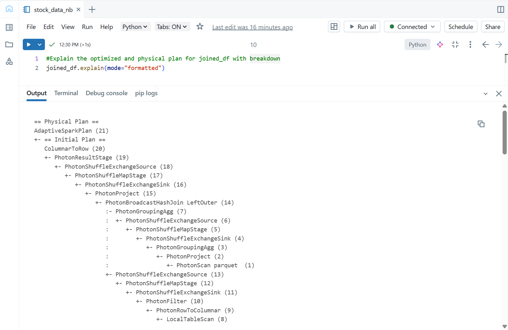
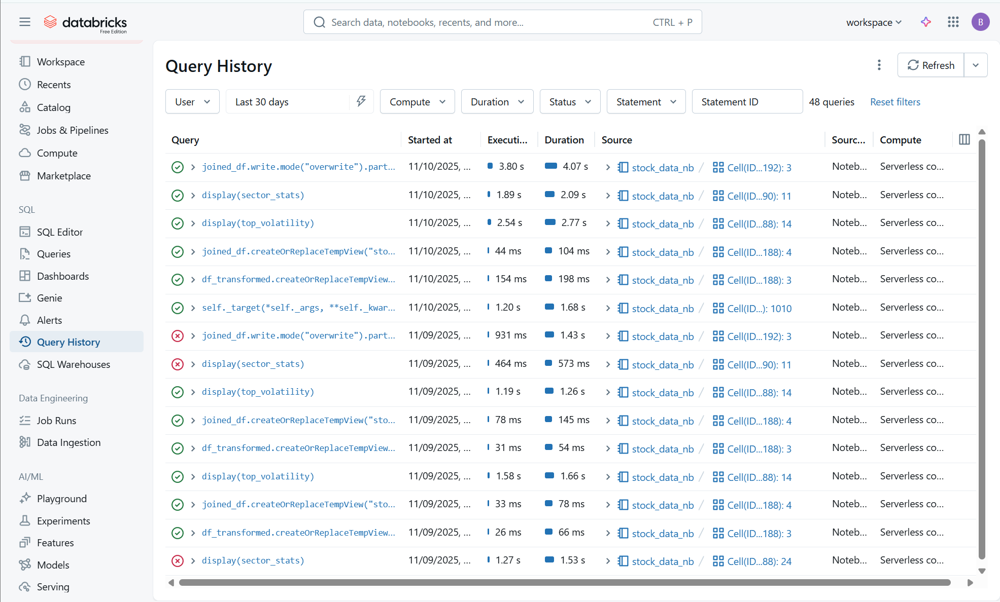

# IDS706 PySpark Data Processing with Databricks
## 0. Data Source and Acknowledgement
**Source: [Kaggle Link](https://www.kaggle.com/datasets/jakewright/9000-tickers-of-stock-market-data-full-history/)**\
**Stock Market Data: 9,000+ Tickers (1962 - Present)**
### Dataset Overview
This dataset offers comprehensive historical stock market data covering over 9,000 tickers from 1962 to the present day. It includes essential daily trading information, making it suitable for various financial analyses, trend studies, and algorithmic trading model development.
### Columns
- **Date**: The date of the recorded trading data.
- **Ticker**: The stock symbol of the company.
- **Open**: Opening price of the stock on the trading day.
- **High**: Highest price reached during the trading day.
- **Low**: Lowest price reached during the trading day.
- **Close**: Closing price of the stock on the trading day.
- **Volume**: The total number of shares traded during the day.
- **Dividends**: Cash dividends issued on the date, if applicable.
- **Stock Splits**: Stock split factor for the date, if any split occurred.
  
## 1. Data Processing Pipeline (see notebook for details)
- Load data using PySpark (Parquet, or any format)
- Apply transformations:
  - 2+ filter operations
  - 1+ join operation (if using multiple datasets) OR complex aggregation
  - 1+ groupBy with aggregations
  - Column transformations using withColumn
- 2+ SQL queries
- Optimize your queries:
  - Write filters early in your pipeline
  - Use appropriate partitioning
  - Avoid unnecessary shuffles where possible
- Write results to a destination (Parquet files, database, etc.)
 
## 2. Performance Analysis
### Use .explain() to show the physical execution plan

```Python
== Physical Plan ==
AdaptiveSparkPlan (21)
+- == Initial Plan ==
   ColumnarToRow (20)
   +- PhotonResultStage (19)
      +- PhotonShuffleExchangeSource (18)
         +- PhotonShuffleMapStage (17)
            +- PhotonShuffleExchangeSink (16)
               +- PhotonProject (15)
                  +- PhotonBroadcastHashJoin LeftOuter (14)
                     :- PhotonGroupingAgg (7)
                     :  +- PhotonShuffleExchangeSource (6)
                     :     +- PhotonShuffleMapStage (5)
                     :        +- PhotonShuffleExchangeSink (4)
                     :           +- PhotonGroupingAgg (3)
                     :              +- PhotonProject (2)
                     :                 +- PhotonScan parquet  (1)
                     +- PhotonShuffleExchangeSource (13)
                        +- PhotonShuffleMapStage (12)
                           +- PhotonShuffleExchangeSink (11)
                              +- PhotonFilter (10)
                                 +- PhotonRowToColumnar (9)
                                    +- LocalTableScan (8)


(1) PhotonScan parquet 
Output [7]: [Date#11021, Ticker#11022, Open#11023, High#11024, Close#11026, Volume#11027, Dividends#11028]
DictionaryFilters: [(Close#11026 > 0.0)]
Location: InMemoryFileIndex [dbfs:/Volumes/workspace/default/parquetdata/all_stock_data.parquet]
ReadSchema: struct<Date:date,Ticker:string,Open:double,High:double,Close:double,Volume:double,Dividends:double>
RequiredDataFilters: [isnotnull(Date#11021), isnotnull(Close#11026), (Close#11026 > 0.0), (year(Date#11021) >= 2015)]

(2) PhotonProject
Input [7]: [Date#11021, Ticker#11022, Open#11023, High#11024, Close#11026, Volume#11027, Dividends#11028]
Arguments: [Ticker#11022, High#11024, Volume#11027, Dividends#11028, CASE WHEN NOT (Open#11023 = 0.0) THEN round((((Close#11026 - Open#11023) / Open#11023) * 100.0), 2) END AS Daily_Return_Percent#11033]

(3) PhotonGroupingAgg
Input [5]: [Ticker#11022, High#11024, Volume#11027, Dividends#11028, Daily_Return_Percent#11033]
Arguments: [Ticker#11022], [partial_avg(Daily_Return_Percent#11033) AS (sum#11273, count#11274L), partial_avg(Volume#11027) AS (sum#11277, count#11278L), partial_max(High#11024) AS max#11280, partial_sum(Dividends#11028) AS sum#11282], [sum#11271, count#11272L, sum#11275, count#11276L, max#11279, sum#11281], [Ticker#11022, sum#11273, count#11274L, sum#11277, count#11278L, max#11280, sum#11282], false

(4) PhotonShuffleExchangeSink
Input [7]: [Ticker#11022, sum#11273, count#11274L, sum#11277, count#11278L, max#11280, sum#11282]
Arguments: hashpartitioning(Ticker#11022, 1024)

(5) PhotonShuffleMapStage
Input [7]: [Ticker#11022, sum#11273, count#11274L, sum#11277, count#11278L, max#11280, sum#11282]
Arguments: ENSURE_REQUIREMENTS, [id=#8628]

(6) PhotonShuffleExchangeSource
Input [7]: [Ticker#11022, sum#11273, count#11274L, sum#11277, count#11278L, max#11280, sum#11282]

(7) PhotonGroupingAgg
Input [7]: [Ticker#11022, sum#11273, count#11274L, sum#11277, count#11278L, max#11280, sum#11282]
Arguments: [Ticker#11022], [finalmerge_avg(merge sum#11273, count#11274L) AS avg(Daily_Return_Percent)#11267, finalmerge_avg(merge sum#11277, count#11278L) AS avg(Volume)#11268, finalmerge_max(merge max#11280) AS max(High)#11269, finalmerge_sum(merge sum#11282) AS sum(Dividends)#11270], [avg(Daily_Return_Percent)#11267, avg(Volume)#11268, max(High)#11269, sum(Dividends)#11270], [Ticker#11022, avg(Daily_Return_Percent)#11267 AS Avg_Daily_Return#11037, avg(Volume)#11268 AS Avg_Daily_Volume#11038, max(High)#11269 AS All_Time_High#11039, sum(Dividends)#11270 AS Total_Dividends#11040], true

(8) LocalTableScan
Output [2]: [Ticker#11052, Sector#11053]
Arguments: [Ticker#11052, Sector#11053]

(9) PhotonRowToColumnar
Input [2]: [Ticker#11052, Sector#11053]

(10) PhotonFilter
Input [2]: [Ticker#11052, Sector#11053]
Arguments: isnotnull(Ticker#11052)

(11) PhotonShuffleExchangeSink
Input [2]: [Ticker#11052, Sector#11053]
Arguments: SinglePartition

(12) PhotonShuffleMapStage
Input [2]: [Ticker#11052, Sector#11053]
Arguments: EXECUTOR_BROADCAST, [id=#8638]

(13) PhotonShuffleExchangeSource
Input [2]: [Ticker#11052, Sector#11053]

(14) PhotonBroadcastHashJoin
Left keys [1]: [Ticker#11022]
Right keys [1]: [Ticker#11052]
Join type: LeftOuter
Join condition: None

(15) PhotonProject
Input [7]: [Ticker#11022, Avg_Daily_Return#11037, Avg_Daily_Volume#11038, All_Time_High#11039, Total_Dividends#11040, Ticker#11052, Sector#11053]
Arguments: [Ticker#11022, Avg_Daily_Return#11037, Avg_Daily_Volume#11038, All_Time_High#11039, Total_Dividends#11040, Sector#11053]

(16) PhotonShuffleExchangeSink
Input [6]: [Ticker#11022, Avg_Daily_Return#11037, Avg_Daily_Volume#11038, All_Time_High#11039, Total_Dividends#11040, Sector#11053]
Arguments: hashpartitioning(Sector#11053, 1024)

(17) PhotonShuffleMapStage
Input [6]: [Ticker#11022, Avg_Daily_Return#11037, Avg_Daily_Volume#11038, All_Time_High#11039, Total_Dividends#11040, Sector#11053]
Arguments: REPARTITION_BY_COL, [id=#8645]

(18) PhotonShuffleExchangeSource
Input [6]: [Ticker#11022, Avg_Daily_Return#11037, Avg_Daily_Volume#11038, All_Time_High#11039, Total_Dividends#11040, Sector#11053]

(19) PhotonResultStage
Input [6]: [Ticker#11022, Avg_Daily_Return#11037, Avg_Daily_Volume#11038, All_Time_High#11039, Total_Dividends#11040, Sector#11053]

(20) ColumnarToRow
Input [6]: [Ticker#11022, Avg_Daily_Return#11037, Avg_Daily_Volume#11038, All_Time_High#11039, Total_Dividends#11040, Sector#11053]

(21) AdaptiveSparkPlan
Output [6]: [Ticker#11022, Avg_Daily_Return#11037, Avg_Daily_Volume#11038, All_Time_High#11039, Total_Dividends#11040, Sector#11053]
Arguments: isFinalPlan=false
```
### Databricks Query Details view


### Query Optimization Analysis
- Catalyst & Photon optimization
- Filter pushdown evidence
- Bottlenecks
- Pipeline optimization: Ordering, pruning, partitioning
  
From the physical plan, we can see that Spark applied Catalyst optimization and executed the query using the Photon engine for vectorized processing (PhotonScan, PhotonGroupingAgg, PhotonBroadcastHashJoin). This indicates that Spark optimized the job into a columnar execution plan, leveraging efficient in-memory columnar data flow and automatic predicate pushdown into the Parquet reader. The plan shows that filters were applied early (as PhotonFilter appears before shuffles and aggregations), minimizing the amount of data shuffled across the cluster.

Spark also pushed down filters during the Parquet scan phase, meaning only relevant rows and columns were read from disk. The use of PhotonBroadcastHashJoin suggests Spark optimized the join between the aggregated stock data and the smaller company_info_df by broadcasting the small dataset to all worker nodes — eliminating the need for a full shuffle join, which significantly improves performance.

Potential performance bottlenecks likely come from the multiple shuffle stages (PhotonShuffleExchangeSink and PhotonShuffleExchangeSource) caused by grouping and partitioning operations. These are costly in wide transformations such as groupBy and joins. To mitigate this, filters were applied early in the pipeline (e.g., filtering invalid or pre‑2015 rows before joins), and only necessary columns were selected in transformations (column pruning). Additionally, repartitioning by Sector before writing reduced shuffle volume and ensured even data distribution across partitions, improving both read and write efficiency.

### Caching optimization
Show how .cache() improves performance for repeated actions
```Python
from pyspark.sql.functions import col, year
import time

df_filtered = df.filter((col("Close") > 0) & (year(col("Date")) >= 2015))

# ----- First Action: Without caching -----
start = time.time()
df_filtered.count()
print("First action (uncached) took:", round(time.time() - start, 2), "seconds")

# ----- Cache the DataFrame -----
df_filtered.cache()

# Trigger caching by performing an action (e.g., count)
df_filtered.count()

# ----- Second Action: With caching -----
start = time.time()
df_filtered.count()
print("Second action (cached) took:", round(time.time() - start, 2), "seconds")
```
The first uncached action will take longer (Spark scans and computes everything).
**After caching, subsequent actions on the same DataFrame run significantly faster, since Spark loads the data from memory instead of recomputing.**

### Pipeline Exeucution

## 3. Actions vs Transformations
Demonstration showing the difference between transformations (lazy) and actions (eager):

## 4. Machine Learning
Use MLlib for a simple ML task (classification, regression, or clustering)
